 

---

## Обо мне

Frontend-разработчик, **3+ года** в коммерческой разработке. Два рабочих трека (как на hh):

| Трек | Фокус |
|------|--------|
| **Продукт** | React, TypeScript, Vue/Nuxt — SPA/SSR, кабинеты, дашборды, CRM |
| **Performance** | CPA/affiliate-лендинги, Keitaro, A/B-воронки, Python build-пайплайн |

- **100+** адаптивных лендингов под живой рекламный трафик (Figma → прод)
- Продукт: **React + TypeScript** (EdTech SPA/SSR), **Vue 2 → 3** (Composition API, TS)
- Свой кейс: [CRM выдачи бирок](https://artemegorov007.github.io/dealio/badges) для промышленного заказчика (Nuxt 3 + Apps Script) — в ежедневной работе у команды
- AI-assisted workflow: Cursor, Claude Code, MCP; автоматизация сборки на Python
- Портфолио-лендинг (без рабочих офферов): [Cade Stories](https://artemegorov007.github.io/cade-stories/)

## Стек

**Вёрстка**

**JS / фреймворки**

**Также:** Redux · Pinia · MobX · Vitest · Docker · Python · PHP · Keitaro · Playwright · REST API

## Опыт

**KINTECH GROUP** — Frontend · `фев 2026 — н.в.`  
Performance-лендинги (CPA). Keitaro (потоки, postback/S2S), DynamicOffer / A/B; Python-пайплайн scrape → validate → zip (цикл ×3–4); AI-assisted сборка и QA.  
`HTML` · `SCSS` · `JS` · `Python` · `Keitaro`

**TutorPlace** — Frontend (React) · `дек 2023 — фев 2026`  
EdTech: React + TypeScript (SPA/SSR) — ЛК, дашборды, видеоплеер; 100+ лендингов; общий шаблон проекта для команды.  
`React` · `TypeScript` · `Redux` · `Tailwind`

**Weeek** — Frontend (Vue) · `июн 2023 — ноя 2023`  
Партнёрский кабинет и админка с нуля; миграция Vue 2 → 3, JS → TS, i18n, Vitest, Docker.  
`Vue 2/3` · `TypeScript` · `Vuex` · `Vitest` · `Docker`

## Проекты

> Все с демо на GitHub Pages

| | Проект | Что это | Стек | Ссылки |
|:--:|--------|---------|:----:|:------:|
| 1 | **Dealio** | Kanban + **коммерческая CRM** учёта бирок (промышленный заказчик): поиск 300+ позиций, защита от повторной выдачи, PWA | Nuxt 3 · Pinia · Apps Script | [CRM](https://artemegorov007.github.io/dealio/badges) · [code](https://github.com/ArtemEgorov007/dealio) |
| 2 | **Cade Stories** | Демо CPA white-page: гайд, блог, legal, mobile-first | PHP · CSS · JS | [demo](https://artemegorov007.github.io/cade-stories/) · [code](https://github.com/ArtemEgorov007/cade-stories) |
| 3 | **Sonora** | Музыкальный плеер на Jamendo API: очередь, подборки | React 19 · TS · MobX | [demo](https://artemegorov007.github.io/sonora/) · [code](https://github.com/ArtemEgorov007/sonora) |
| 4 | **Pulse** | Новостная лента (NewsAPI), тёмная тема | Vue 3 · Vuex · Vite | [demo](https://artemegorov007.github.io/pulse/) · [code](https://github.com/ArtemEgorov007/pulse) |
| 5 | **Gallera** | Галерея с фильтрами и lightbox — FSD | React · FSD | [demo](https://artemegorov007.github.io/gallera/) · [code](https://github.com/ArtemEgorov007/gallera) |

## GitHub

## Связь

  

